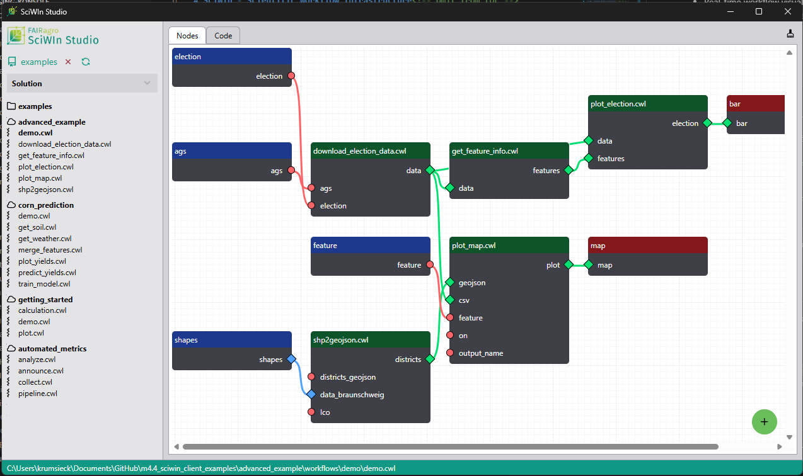

<a name="top"></a>
<p align="center">
   
</p>

# SciWIn - Scientific Workflow Infrastructure<!-- omit from toc -->

![Rust][rust-image] 
[](https://github.com/fairagro/sciwin/actions/workflows/ci.yml)

[](https://github.com/fairagro/sciwin/releases/latest)
[]([https](https://github.com/fairagro/sciwin/releases/latest))


⭐ **Star this Repo** to say "Thank you!" ⭐

[](https://www.linkedin.com/sharing/share-offsite/?url=https://github.com/fairagro/sciwin)
[](https://www.reddit.com/submit?title=Check%20out%20this%20project%20on%20GitHub:%20https://github.com/fairagro/sciwin)
[](https://www.facebook.com/sharer/sharer.php?u=https://github.com/fairagro/sciwin)
[](https://x.com/intent/tweet?text=Check%20out%20this%20project%20on%20GitHub:%2[https://github.com/fairagro/sciwin](https://github.com/fairagro/sciwin))

📖 Read the **[Documentation](https://fairagro.github.io/sciwin/)** to get started or take a look at some [examples](https://github.com/fairagro/m4.4_sciwin_client_examples)! 🚀

🦀 Take a look at our latest publications and talks 👀
- [SciWIn-Client and SciWIn-Studio: Simplifying FAIR Computational Workflows](https://doi.org/10.5281/zenodo.19060805), FAIRagro Community Summit 2026
- [FAIR, fast, and frictionless – computational workflows with SciWIn](https://doi.org/10.5281/zenodo.17651648), FDM Niedersachsen DataDays 2025 
- [FAIRagro Talk: SciWIn – making your workflows work for you](https://fairagro.net/event/fairagro-talk-sciwin-making-your-workflows-work-for-you/), FAIRagro Talk Nov. 2025
- [Easy creation of reproducible computational workflows with SciWIn-Client](https://doi.org/10.5281/zenodo.17119086), CoRDI 2025
- [SciWIn Client: Reproducible computational workflows made easy](https://doi.org/10.5281/zenodo.14098277), FAIRagro Plenary 2024
- [Lightning Talk: Boosting Scientific Reusability](https://doi.org/10.5281/zenodo.12743569), FAIRagro Community Summit 2024
- [Poster: Boosting Scientific Reusability](https://doi.org/10.5281/zenodo.11619214), FAIRagro Comminity Summit 2024

or the FAIRagro Blogpost:
[SciWIn-Client – what is it actually?](https://fairagro.net/en/sciwin-client-what-is-it-actually/)

## 📖 Table of Contents<!-- omit from toc -->
- [🚀 About](#-about)
- [🏗️ How to Build and Test](#️-how-to-build-and-test)
- [💚 SciWin Studio](#-sciwin-studio)
- [🎯 Installation](#-installation)
- [📚 How to Use](#-how-to-use)
  - [Project initialization](#project-initialization)
  - [Creation of CWL CommandLineTools](#creation-of-cwl-commandlinetools)
  - [Creation of CWL Workflows](#creation-of-cwl-workflows)
  - [Execution of CWL Files](#execution-of-cwl-files)
- [🪂 Contributors](#-contributors)
- [⚖️ License](#️-license)


## 🚀 About
Computational workflows, which define complex, multi-step procedures for automated execution, are crucial for ensuring reproducibility, scalability, and efficiency in scientific research. The FAIRagro Scientific Workflow Infrastructure (SciWIn) empowers scientists to create, execute, share, and publish these workflows, promoting collaboration and transparency.

This repository consists of two complementary tools: **SciWIn-Client** and **SciWIn-Studio** (currently in testing).

Reproducibility in computational research is essential for effective collaboration, result verification, and maintaining transparency. However, it remains challenging due to complex workflows, inconsistent data management practices, and dependencies on specific software environments. **SciWIn-Client** is a command-line tool designed to simplify the creation, recording, annotation, and execution of computational workflows. It enables researchers to interactively use intuitive commands to track tasks such as data extraction, cleaning, transformation, analysis, visualization, and computational simulation. By automating and standardizing workflows, SciWIn-Client minimizes error sources and supports transparent, reproducible Open Science practices.

**SciWIn-Studio** provides a graphical user interface that makes workflow management accessible to researchers who prefer visual tools over command-line interactions, offering an intuitive alternative for designing and executing computational workflows without requiring terminal expertise.


## 🏗️ How to Build and Test
This project is being developed using Rust and Cargo. 
To run SciWIn-Client you can just use `cargo run` to run from source code, to build use `cargo build`. 

To run the tests use `cargo nextest` or `bacon nextest` to run as watcher (implying that bacon and nextest are installed).

```bash
# Clone the repository
git clone https://github.com/fairagro/sciwin
cd sciwin

# Build the project
cargo build

# Run the project
cargo run
```

To run tests (unit and integration)
```bash
cargo nextest --workspace           # Run all tests
```

## 💚 SciWin Studio
**SciWIn-Studio** is a graphical user interface (GUI) application currently in testing that complements SciWIn-Client. It provides an intuitive visual environment for researchers who prefer graphical tools over command-line interactions.
### Features
- Visual workflow design and management
- Drag-and-drop interface for connecting workflow steps
- Real-time workflow visualization
- Accessible workflow creation without terminal expertise



### Running SciWIn-Studio
To run SciWIn-Studio in Development mode, you need to [install the Dioxus CLI `dx`](https://dioxuslabs.com/learn/0.7/getting_started/):
```bash
# Install requirements
sudo apt-get update 
sudo apt-get install -y \
    libgtk-3-dev \
    libglib2.0-dev \
    libwebkit2gtk-4.1-dev \
    build-essential \
    curl \
    wget \
    file \
    libxdo-dev \
    libssl-dev \
    libayatana-appindicator3-dev \
    librsvg2-dev

# Install Dioxus CLI
curl -sSL https://dioxus.dev/install.sh | bash

# or (slower)
cargo install dioxus-cli

# Navigate to the project directory
cd sciwin

# Launch SciWIn-Studio in debug mode
dx serve -p sciwin
```
> [!NOTE]
> SciWIn-Studio is currently in testing phase. Features and functionality may change as development progresses.

## 🎯 Installation
Detailed installation instructions can be found at the [latest release](https://github.com/fairagro/sciwin/releases/latest):

[](https://github.com/fairagro/sciwin/releases/latest)

The easiest way is to use the `shell` or `powershell` scripts with the provided commands.
To install latests binaries you can use the following scripts:

### Linux/MacOS:
```bash
curl --proto '=https' --tlsv1.2 -LsSf https://fairagro.github.io/sciwin/get_s4n.sh | sh 
```
If `curl` responds with code 429 you can try to use `wget` instead. 
```bash
wget -qO- https://fairagro.github.io/sciwin/get_s4n.sh | sh 
```


### Windows:
```powershell
powershell -ExecutionPolicy Bypass -c "irm https://fairagro.github.io/sciwin/get_s4n.ps1 | iex"
```

## 📚 How to Use
Take a look at the **[User documentation](https://fairagro.github.io/sciwin/)**. An overview on how to use SciWIn Client is available below.

### Project initialization
Most commands need the context of a Git repo to work. Project initialization can be done using the `s4n init` command.
```bash
s4n init -p <FOLDER/PROJECT NAME>
```
Besides the minimal project structure, the creation of an ["Annotated Research Context"](https://arc-rdm.org/) or ARC is also possible.
```bash
s4n init -a -p <FOLDER/PROJECT NAME>
```

> [!IMPORTANT]
> The commands have changed in v1.0.0 (**Breaking Change**). The mapping is as follows:
> | Old Command               | New Command            |
>  |---------------------------|------------------------|
>  | s4n tool create           | s4n create             |
>  | s4n tool list             | s4n list               |
>  | s4n tool remove           | s4n remove             |
>  | s4n workflow create       | s4n create --name (optional!)|
>  | s4n workflow list         | s4n list               |
>  | s4n workflow remove       | s4n remove             |
>  | s4n workflow status       | s4n list [WORKFLOW_NAME]|
>  | s4n workflow connect      | s4n connect            |
>  | s4n workflow disconnect   | s4n disconnect         |
>  | s4n workflow visualize    | s4n visualize          |
>  | s4n workflow save         | s4n save               |

### Creation of CWL CommandLineTools
To create [CWL](https://www.commonwl.org/) CommandLineTools which can be combined to workflows later a prefix command can be used. `s4n create` will execute any given command and creates a CWL CommandLineTool accordingly.
```bash
s4n create <COMMAND> [ARGUMENTS]
```
The command comes with a lot of different options on how to handle the CWL creation specifically.
```
Creates a new CWL File or Workflow

Usage: s4n create [OPTIONS] [COMMAND]...

Arguments:
  [COMMAND]...  Command line call e.g. python script.py [ARGUMENTS]

Options:
  -n, --name <NAME>                        A name to be used for this workflow or tool
  -c, --container-image <CONTAINER_IMAGE>  An image to pull from e.g. docker hub or path to a Dockerfile
  -t, --container-tag <CONTAINER_TAG>      The tag for the container when using a Dockerfile
  -r, --raw                                Outputs the raw CWL contents to terminal
      --no-commit                          Do not commit at the end of tool creation
      --no-run                             Do not run given command
      --clean                              Deletes created outputs after usage
      --no-defaults                        Removes default values from inputs
      --net                                Enables network in container
  -i, --inputs <INPUTS>                    Force values to be considered as an input.
  -o, --outputs <OUTPUTS>                  Force values to be considered as an output.
  -m, --mount <MOUNT>                      Mounts a directory into the working directory
  -f, --force                              Overwrites existing workflow
  -h, --help                               Print help

```

### Creation of CWL Workflows
CWL Workflows can be created semi-automatically using `s4n connect` commands. Connections to In- or Outputs are added using either `@inputs` or `@outputs` as file identifier.
```bash
s4n connect <NAME> --from [FILE]/[SLOT] --to [FILE/SLOT]
```
For example: `s4n connect demo --from @inputs/speakers --to calculation/speakers` - The Step `calculation` will be added pointing to `workflows/calculation/calculation.cwl`, which will use the newly created input `speakers` as input for its `speakers` input.

### Execution of CWL Files
SciWIn-Client comes with its custom CWL Runner (which does not support all `cwltool` can do, yet!) to run Workflows and CommandLineTools. The command `s4n execute local` can also be triggered using `s4n ex l`.
```bash
s4n execute local <CWLFILE> [ARGUMENTS]
```

## 🪂 Contributors
<a href="https://github.com/fairagro/sciwin/graphs/contributors">
  
</a>

<small>Made with [contrib.rocks](https://contrib.rocks).</small>

|[Measure 4.4](https://fairagro.net/tag/measure-4-4/)|||
|--|--|--|
|Jens Krumsieck|[:octocat: @jenskrumsieck](https://github.com/JensKrumsieck)|[ORCID: 0000-0001-6242-5846](https://orcid.org/0000-0001-6242-5846)|
|Antonia Leidel|[:octocat: @aleidel](https://github.com/aleidel)|[ORCID: 0009-0007-1765-0527](https://orcid.org/0009-0007-1765-0527)|
|Patrick König|[:octocat: @patrick-koenig](https://github.com/patrick-koenig)|[ORCID: 0000-0002-8948-6793](https://orcid.org/0000-0002-8948-6793)|
|Xaver Stiensmeier|[:octocat: @XaverStiensmeier](https://github.com/XaverStiensmeier)|[ORCID: 0009-0005-3274-122X](https://orcid.org/0009-0005-3274-122X)|
|Harald von Waldow|[:octocat: @hvwaldow](https://github.com/hvwaldow)|[ORCID: 0000-0003-4800-2833](https://orcid.org/0000-0003-4800-2833)|

---
**Funded by**


DFG project number 501899475

## ⚖️ License

This work is dual-licensed under Apache 2.0 and MIT .
You can choose between one of them if you use this work.
`SPDX-License-Identifier: Apache-2.0 OR MIT`

<!--section images-->
[rust-image]: https://img.shields.io/badge/Rust-%23000000.svg?e&logo=rust&logoColor=white

## 🏁 Quick Links
- [📄 Docs](https://fairagro.github.io/sciwin/)
- [🛠️ Releases](https://github.com/fairagro/sciwin/releases)
- [🌐 FAIRagro](https://fairagro.net/)

[🔼 Back to Top](#top)
