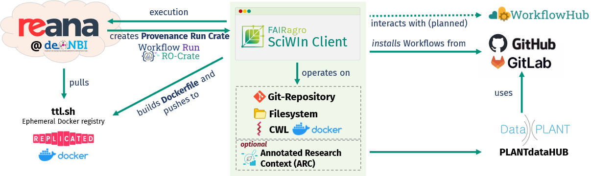

# Summary
SciWIn-Client is a command-line tool developed as part of the _Scientific Workflow Infrastructure (SciWIn)_ of the FAIRagro-Consortium [@Ewert2023Proposal]. It is designed to streamline the creation, execution and management of reproducible computational workflows using the _Common Workflow Language (CWL)_.
SciWIn-Client enables researchers to generate and modify _CWL CommandLineTools_ and _Workflows_ with minimal effort. It supports bothlocal and remote workflow execution in containerized environments, ensuring consistent and reproducible results across different systems.
By integrating Git as a native backend, SciWIn-Client promotes transparent and collaborative workflow development, enabling versioned provenance tracking and seamless sharing of computational processes.

# Statement of Need
Automated computational workflows are essential for managing complex, multi-step data analysis across various scientific disciplines. Significant effort has been invested into domain-specific languages that formalize and standardize computational scientific processes, thereby enhancing reproducibility, scalability and efficiency. In order to harmonize and standardize the proliferation of such languages, the Common Workflow Language (CWL) was introducted as universal standard [@Crusoe2022MethodsIncluded]. 
Its design emphasizes flexibility and machine readability but its verbose YAML-based syntax poses a barrier to adoption among researchers unfamiliar with such structured data formats. CWL therefore is predestined to be written by machines rather than humans, which ultimately led to the conception of SciWIn-Client.
SciWIn-Client provides an intuitive command-line interface that automates CWL generation and management. It translates typical research computing tasks into structured, version-controlled workflow definitions, effectively allowing scientists to “write CWL by doing science.”

# Features and Implementation
SciWIn-Client (short: `s4n`) is implemented in the Rust programming language, chosen for its high performance, strong type safety, and robust error handling — qualities essential in scientific software. Git integration provides built-in version control and interoperability with research data management frameworks such as  DataPLANTs ARC [@dataplant2025ARCSpec][@Weil2023PLANTdataHUB] format which can be viewed as a Git-based implementation of the RO-Crate standard [@SoilandReyes2022ROCrate].

## Managing CWL Files
A central concept of the tool is the automation of CWL generation. When users invoke a command or script using the `s4n create` prefix SciWIn-Client analyzes the command-line inputs and execution to identify `inputs`, `baseCommand` and `requirements` metadata and creates a CWL CommandLineTool. SciWIn-Client uses Git in background  a version-controlled environment for tracking changes and support this process. However most importantly Git serves information of changed files to create the  `outputs`-Section of the CWL CommandLineTool. While the system can automatically infer inputs and outputs, users also have the option to define them explicitly. Users can specify a container image pulled from Docker Hub or provide paths to local Dockerfiles to ensure consistent, reproducible execution environments across different systems.

Once individual CWL CommandLineTools have been created, the next step is to combine them into a CWL Workflow. This is achieved using the `s4n connect` command, which allows the user to specify a source (starting tool or node) and a target (a subsequent tool or node). By linking the output of one tool to the input of another, the user defines the workflow's execution sequence. 

In order to expand the possible sources for connecting complex workflows, there is the option to `install` exisiting workflows using SciWIn-Client which internally uses Git's submodule feature. ...

Annotate...

## Workflow Execution
The simplest way to execute a workflow is to run it directly on the machine where the workflow is defined by using the `s4n execute local` command (or `cwltool` which however does not support Windows).
When performing high demanding calculations, workflows often need to be dispatched to large compute clusters. For the execution on compute clusters SciWIn-Client is able to communicate with the REST-API of Reana instances [@Simko2019Reana]. Reana is a reproducible research data analysis platform provided by CERN. FAIRagro operates their own Reana Installation in de.NBI Cloud. 
Structured execution results in form of RO-crates [@SoilandReyes2022ROCrate] more specifically Workflow Run RO-Crates [@Leo2024WRRC] using the Provenance Run Crate profile can be exported. 

# Conclusion and Outlook

SciWin-Client is a powerful tool for building, managing and executing complex computational pipelines locally and at scale on Reana instances. The code is hosted in a public GitHub repository (https://github.com/fairagro/m4.4_sciwin_client). 
Future development will focus of extending SciWIn-Client with the possiblity to publish workflows to workflowhub.eu [@gustafsson_workflowhub_2025] and a graphical user interface to lower the barrier of entry for new users. 

# Acknowledgements 
We gratefully acknowledge the financial support of the German Research Foundation (DFG) – project number 501899475.

# References