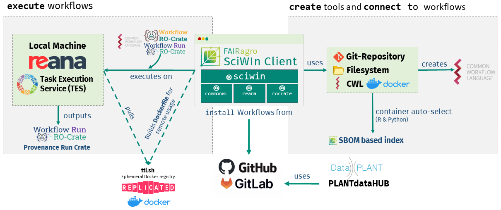

# Summary
SciWIn-Client is a command-line tool developed within the FAIRagro consortium [@Ewert.2023l] as part of the Scientific Workflow Infrastructure (SciWIn). It is designed to streamline the creation, execution and management of reproducible computational workflows using the _Common Workflow Language (CWL)_[@Crusoe.2022]. By wrapping ordinary command-line commands with a thin layer of tooling, SciWIn-Client automatically generates CWL definitions, allowing scientists to write CWL using the well-known commands rather than hand-authoring verbose specifications.
Implemented in Rust for high performance and reliability, SciWIn-Client integrates natively with Git for version control and provenance tracking. It supports both local and remote workflow execution and is interoperable with the Workflow RO-Crate [@Bacall.] and Workflow Run RO-Crate [@Leo.2024] standards. Furthermore SciWIn-Client is interoperable with research data management frameworks such as DataPLANT's ARC format [@DataPLANT.2025;@Weil.2023].

# Statement of need
Automated computational workflows are essential for managing complex, multi-step data analysis across various scientific disciplines. Significant effort has been invested into domain-specific languages that formalize and standardize computational scientific processes, thereby enhancing reproducibility, scalability and efficiency. 
To harmonize this wild growth of languages, the Common Workflow Language (CWL) was  introduced as universal standard [@Crusoe.2022]. Its design emphasizes flexibility and machine readability but its verbose YAML-based syntax poses a substantial barrier to adoption among researchers unfamiliar with structured data formats. 

CWL therefore is predestined to be written by machines rather than humans, which ultimately motivated the conception of SciWIn-Client. 
SciWIn-Client provides an intuitive command-line interface that automates CWL generation and management. It translates typical research computing tasks into structured, version-controlled workflow definitions, effectively allowing scientists to "write CWL by doing science."

# State of the field
The landscape of scientific workflow management is broad and fragmented. Numerous platforms and languages have emerged to address the need for reproducible, automated data analysis pipeline. Tools such as Nextflow [@DiTommaso.2017], Snakemake [@Molder.2021] and Galaxy [@Giardine.2005;@TheGalaxyCommunity.2024] have achieved significant adoption within the scientific community. Both offer powerful execution environments and rich graphical or scripting environments. Both platforms put significant effort in providing a broad set of scripts especially for the OMICS-community (e.g. nf-core [@Ewels.2020]), however lacking in the agro-community where individual scripting plays a key part. 

Bringing such individual scripts into established workflow platforms can present a substantial hurdle. With Nextflow, researchers need to learn the Groovy-based workflow DSL. In Galaxy, tools may need to undergo a curation and integration process before they become available on a public usegalaxy.* server. Moreover, workflows authored for Galaxy are often coupled to the capabilities and configuration of a particular Galaxy instance, and portability across infrastructures may require additional adaptation.

CWL was introduced as a vendor-neutral, platform agnostic standard to address fragmentation. CWL workflows are portable by design as they in principle can run on any compliant execution engine. There were even efforts to make Galaxy and Nextflow compliant to this standard [@DiTommaso.2018]. Bridges to CWL have remained partial: the cwl2nxf converter for Nextflow was archived in 2025, and CWL support in Galaxy has been an open draft since 2021 [@Soranzo.2021]. The adoption of CWL remains lower than that of Snakemake, Nextflow and Galaxy, and the standard provides comparatively little support for workflow creation. Its verbose, YAML-based syntax requires familiarity with structured data formats and workflow abstractions that many domain researchers do not possess. This creates a gap between the portability offered by a standardized workflow representation and the accessibility of authoring such workflows.

The CWL ecosystem further compounds this problem. While a number of great runner implementations exist (e.g. cwltool, Toil [@Vivian.2017], REANA, Arvados)[@CommonWorkflowLanguage.], which are mostly written in Python and however do not support Windows natively. cwltool  the reference implementation, requires the Windows Subsystem for Linux (WSL) on Windows. The space of authoring tools is sparse [@CommonWorkflowLanguage.b]. Rabix offered a graphical editor (Rabix Composer)[@Kaushik.2016] which was made closed-source and moved into the Seven Bridges Platform [@RabixComposercontributors.2021]. The open-sourced version has been unmaintained for over 5 years and is significantly outdated. Many generators are outdated as well, meaning there is no actively developed open and lightweight CWL generator that integrates naturally into a researchers existing command-line-driven "workflow". `argparse2tool` (last commit 2024) only covers Python argparse programs, `scriptcwl` (last commit 2020) and Janis (last commit 2023) require writing Python scripts and ToolJig [@Piccolo.2021] uses Web Forms. `zatsu-cwl-generator` (last commit 2022) is the closest to our apporach, however it parses a command without running it, so it can not observe files the command creates.

SciWIn-Client addresses this authoring gap by allowing researchers to create CWL workflows from their existing command-line-oriented workflows without requiring them to author the CWL document manually. It operates fully offline, has no dependency on a specific workflow platform, integrates with Git-based workflows, and is distributed as a single self-contained binary.

A related but distinct line of work concerns tools that capture computational environments or provenance by observing program execution. Examples include ReproZip [@Chirigati.2016], noWorkflow [@Pimentel.2017], and Sciunit[@TonThat.2017]. These systems demonstrate that execution traces and runtime information can be used to support reproducibility and provenance capture. They are therefore conceptually close to the execution-based workflow creation approach implemented by SciWIn-Client. However, their primary objective is to capture, package, or reproduce information about an execution, rather than to transform an existing command-line execution into an explicit, reusable workflow specification. SciWIn-Client builds on the information available from execution while using it to generate a machine-actionable workflow description, including the workflow specification and its associated inputs and execution requirements.

# Software design
SciWIn-Client (short: `s4n`) is implemented in the Rust programming language, chosen for its strong type safety, and robust error handling - qualities essential in scientific software. `s4n` builts on a reusable `sciwin` library which itself combines the `commonwl`, `reana` and `rocrate` rust libraries. Those are created as such functionality did not exist prior for the Rust programming language. 
Git integration provides built-in version control and interoperability with research data management frameworks such as  DataPLANTs ARC [@DataPLANT.2025;@Weil.2023] format which can be viewed as a Git-based implementation of the RO-Crate standard[@SoilandReyes.2022].
A over

## Managing CWL Files
A central concept of the tool is the automation of CWL generation. When users invoke a command or script using the `s4n create` prefix SciWIn-Client analyzes the command-line inputs and execution to identify `inputs`, `baseCommand` and `requirements` metadata and creates a CWL CommandLineTool. SciWIn-Client uses Git in background a version-controlled environment for tracking changes and support this process. However most importantly Git serves information of changed files to create the  `outputs`-Section of the CWL CommandLineTool. While the system can automatically infer inputs and outputs, users also have the option to define them explicitly. Users can specify a container image pulled from Docker Hub or provide paths to local Dockerfiles to ensure consistent, reproducible execution environments across different systems.

Once individual CWL CommandLineTools have been created, the next step is to combine them into a CWL Workflow. This is achieved using the `s4n connect` command, which allows the user to specify a source (starting tool or node) and a target (a subsequent tool or node). By linking the output of one tool to the input of another, the user defines the workflow's execution sequence. 

In order to expand the possible sources for connecting complex workflows, there is the option to `install` existing workflows using SciWIn-Client which internally uses Git's submodule feature. 

## Workflow Execution
SciWIn-Client supports worklow execution on multiple backends through the `s4n execute` command. The desired backend can be selected using the `--engine` flag. When performing high demanding calculations, workflows often need to be dispatched to large compute clusters. Besides local execution on the researcher's machine, it is possible to use execute workflows on Reana instances[@Simko.2019] or GA4GH TES servers[@Kanitz.2024]. Reana is a reproducible research data analysis platform provided by CERN. FAIRagro operates their own Reana Installation in de.NBI Cloud.
Workflows can be executed either directly by using CWL files or by using Workflow RO-Crates [@Bacall.] or Workflow Run RO-Crates [@Leo.2024]. Structured execution results in form of Workflow Run RO-Crates using the Provenance Run Crate profile can be exported for each execution run.

# Research impact statement
SciWIn-Client adresses a critical gap in open and reproducible science: The gap between the complexicty of formal workflow standards and the practical capabilities of reserachers. By automating CWL generation directly from command-line interactions, it enables scientists, regardless of their software engineering background, to produce structured, version-controlled, and portable workflow definitions without manual authoring of verbose specifications.

SciWIn-Client was presented at the 2nd Conference on Research Data Infrastructure (CoRDI 2025) in the contribution __Easy creation of reproducible computational workflows with SciWIn-Client__ [@Krumsieck.2025c;@Krumsieck.2025b]. A workshop on SciWIn-Client was subsequently held at the Boosting Biodata Bootcamp 2026 [@antonia-workshop-slides].

Further recent community engagement has included presentations and demonstrations the FDM Niedersachsen DataDays 2025 [@Krumsieck.2025], the NFDI4LS Conference [@ref_poster], the FAIRagro Talk series [@Krumsieck.2025d], and the FAIRagro Community Summit 2026 [@Krumsieck.2026].

Within FAIRagro, SciWIn-Client is being used in concrete research workflows. For example FAIRagro Use Case 6 on high-throughput crop growth simulation. The work was demonstrated at the FAIRagro Community Summit 2026 [@Gitahi.2026b]. Compatibility with DataPLANT's ARC format has been showcased in a WorkflowHub [@Gustafsson.2025] publication using the same FAIRagro Use Case 6 workflow [@Gitahi.2026] by annotating the SciWIn-created workflow with DataPLANT tooling. The publication was created as a joint effort between FAIRagro and DataPLANT [@hackaton-report!!].

SciWIn-Client is also integrated into the FAIRagro software infrastructure. Its core functionality is provided as a shared crate used by SciWIn-Studio, a graphical application for workflow authoring that is outside the scope of this publication. Workflows created with SciWIn can also be executed on the FAIRagro REANA instance operated through de.NBI. Through its support for the Task Execution Service (TES) API, SciWIn can also execute workflows on any compatible TES server, including the upcoming v3.x release of ARUNA [Dieckmann.2023;@ArunaObjectStorageTeam.2026].

SciWIn-Client has accumulated over 1700 downloads across its published releases as of September 2026.
The source code is openly available at https://github.com/fairagro/sciwin under the MIT or Apache-2.0 license, and the project welcomes community contributions.

# CRediT authorship contribution statement

**Jens Krumsieck**: Conceptualization, Methodology, Software, Validation, Writing - Original Draft, Writing - Review & Editing, Visualization, 
**Antonia Leidel**: Conceptualization, Methodology, Software, Validation, Writing - Original Draft, Writing - Review & Editing, Visualization, 
**Xaver Stiensmeier**: Conceptualization, Methodology, Validation, Writing - Original Draft, Writing - Review & Editing, 
**Patrick König**: Conceptualization, Methodology, Project administration, 
**Florian Hoedt**: Conceptualization, Funding acquisition, 
**Harald von Waldow**: Conceptualization, Methodology, Writing - Original Draft, Writing - Review & Editing, Supervision, Project administration

# Acknowledgements 
We gratefully acknowledge the financial support of the German Research Foundation (DFG) – project number 501899475.

# AI usage disclosure
All paper content was written manually and reflects the careful thought and input of the authors. 
SciWIn is an open source project, and as such contributors are free to use any tools, AI or otherwise, to generate code contained in pull requests or commits. Claude Code was used as assistant to help with implementation of individual parts. All commits and pull requests are reviewed by the core developers and often iterated on multiple times; therefore, all content in the repository represents the effort and judgment of the authors.

# References
